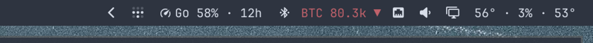
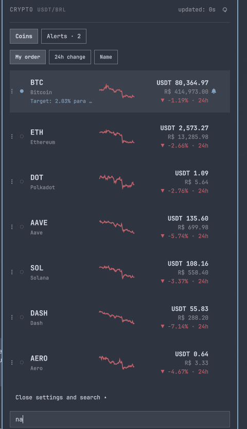
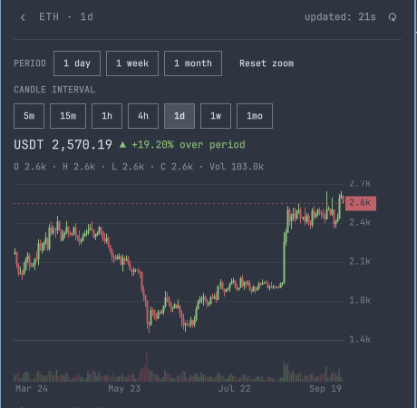
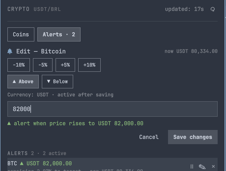
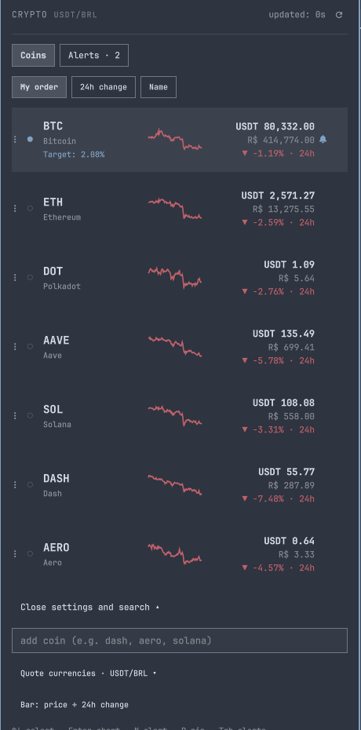

# Omarchy Crypto Widget

Widget de criptomoedas para a barra do [Omarchy](https://omarchy.org/), feito
para Quickshell. Ele mantém a barra compacta e abre um painel completo para
acompanhar moedas, gráficos e alertas.



## O que ele faz

- Mostra ticker, preço compacto e seta de tendência na barra. A largura mede o
  texto atual e cresce somente quando o valor precisa de mais espaço.
- Abre uma lista com preço principal, cotação secundária, variação de 24 horas
  e minigráfico.
- Exibe candles, volume, períodos de 1 dia, 1 semana e 1 mês, zoom e histórico.
- Cria, edita, pausa, rearma e remove alertas de preço com notificação do
  sistema.
- Usa teclado para seleção, busca, gráfico, alertas, fixação, atualização e
  troca de moeda.
- Detecta o idioma do sistema (português, inglês, espanhol, francês e alemão)
  e formata números e valores de acordo com o locale.
- Aceita USD/USDT, BRL, EUR, GBP, JPY, CHF, CAD, AUD, CNY, INR, KRW, MXN e
  ARS. O menu de moedas fica recolhido até ser aberto.
- Persiste preços, minigráficos e séries de candles em
  `~/.cache/omarchy/crypto/market-v1.json` para abrir rapidamente depois de um
  reinício.









## Providers e conversão

O provider padrão é a Binance. Candles usam o par nativo disponível; quando a
moeda escolhida não tem par direto, o preço é convertido a partir de USDT pela
taxa correspondente do CoinGecko. O widget não assume que USDT vale USD e não
recalcula candles históricos com o câmbio atual.

Também é possível usar CoinGecko diretamente para as cotações simples:

```bash
omarchy bar set rafa.crypto provider coingecko
```

## Instalação

Requisitos: Omarchy com Quickshell, `omarchy` no `PATH` e acesso à internet
para consultar as cotações.

```bash
git clone https://github.com/Baratation/omarchy-crypto-widget.git
cd omarchy-crypto-widget
mkdir -p ~/.config/omarchy/plugins
cp -a rafa.crypto ~/.config/omarchy/plugins/
omarchy plugin validate ~/.config/omarchy/plugins/rafa.crypto
omarchy restart shell
```

Para alterar a configuração sem abrir o painel:

```bash
omarchy bar set rafa.crypto coins '["bitcoin","ethereum","solana"]' --json
omarchy bar set rafa.crypto vs brl
omarchy bar set rafa.crypto vs2 usd
omarchy bar set rafa.crypto rotate 8
omarchy bar set rafa.crypto pin bitcoin
```

`pin` fixa uma moeda na barra; deixe vazio para voltar ao ciclo. `vs2` pode ser
deixado vazio para esconder a cotação secundária.

## Teclado e cliques

- `↑`/`↓` ou `j`/`k`: selecionar moeda.
- `Enter`/`G`: abrir o gráfico.
- `N`: criar alerta; `P`: fixar a moeda.
- `Tab`: alternar entre moedas e alertas; `Enter`/`E`: editar alerta.
- `R`: atualizar; `A` ou `/`: buscar; `C`: ligar/desligar ciclo; `U`: trocar
  moeda principal/secundária.
- Clique esquerdo: abrir o painel; direito: enviar resumo; meio: atualizar.

## Testes

Os testes puros não precisam do Quickshell:

```bash
node tests/crypto-model.cjs
node tests/crypto-state.cjs
node tests/crypto-locale-currency.cjs
```

## Estrutura

| Caminho | Função |
| --- | --- |
| `rafa.crypto/BarWidget.qml` | Pílula da barra e IPC do widget |
| `rafa.crypto/Panel.qml` | Estado, polling, lista, busca e alertas |
| `rafa.crypto/Chart.qml` | Candles, volume, zoom e histórico |
| `rafa.crypto/Model.js` | Providers, conversão, catálogo e formatação |
| `rafa.crypto/I18n.js` | Locale, traduções e entrada numérica |
| `rafa.crypto/Cache.js` / `PersistentCache.qml` | Cache persistente validado |
